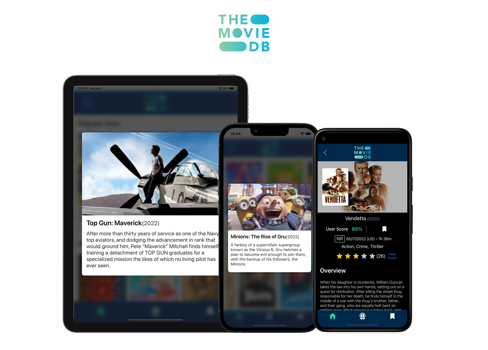
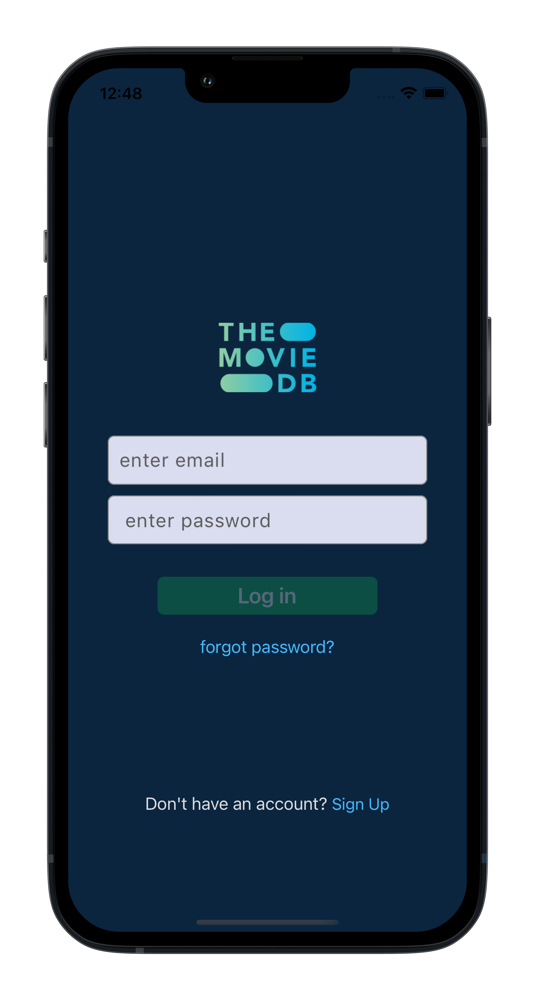
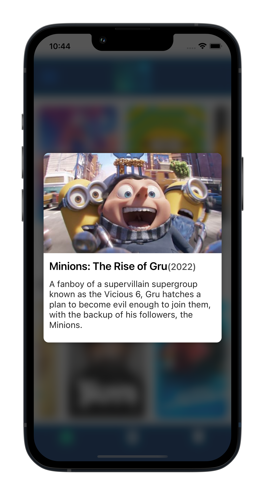
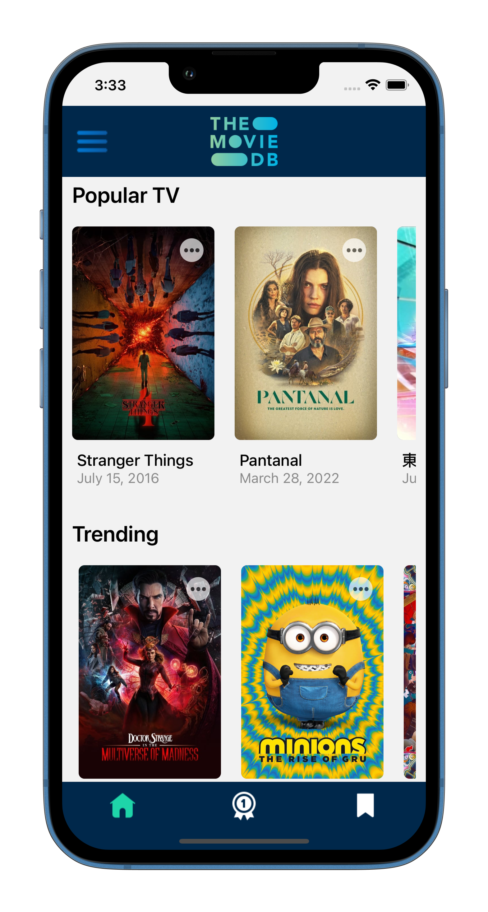
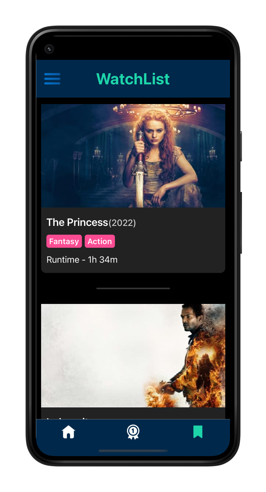
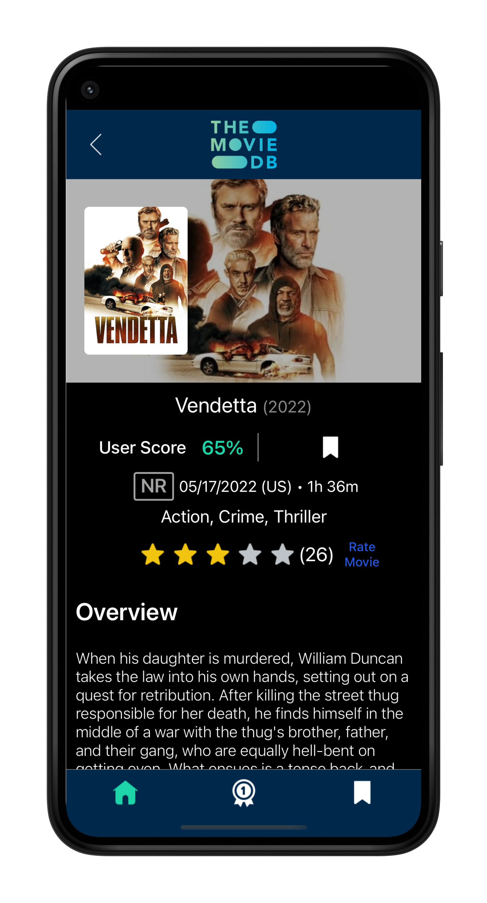
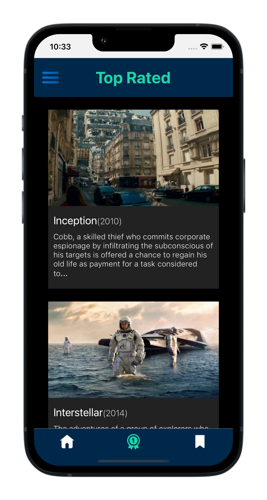
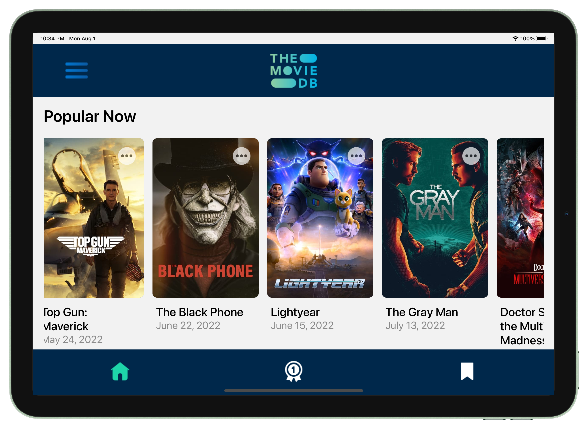

<h2 align="center">A cross-platform MovieDB Application built using React Native</h2>

# MovieDB

MovieDB is an application that uses the MovieDB API and is built with React Native. Users get list of Popular Movies, popular TV shows and trending movies that get updated every hour. User can click on a show/Movie to get additional information.
The users can login with an account and rate movies and add the movie to their watchList. The State management of the application is done using Redux-Toolkit, it is the future of State management in React Native. Get started here [Redux-Toolkit](https://redux-toolkit.js.org/) 

## ReactNative

ReactNative is evolving everyday and It's the best tool to develop cross-platform Apps

> We're working on a large-scale rearchitecture of React Native to make the framework more flexible and integrate better with native infrastructure in hybrid JavaScript/native apps --React

React Native combines the best parts of native development with React, a best-in-class JavaScript library for building user interfaces.
Use a little—or a lot. You can use React Native today in your existing Android and iOS projects or you can create a whole new app from scratch.

## Screenshots

<table>
  <tr>
    <td></td>
    <td></td>
    <td></td>
  </tr>
</table>
<table>
  <tr>
    <td></td>
    <td></td>
    <td></td>
  </tr>
</table>
<table>
  <tr>
    <td></td>
  </tr>
</table>

## Platforms

Currently MovieDB runs on iPhone, iPad, and Android. 

## Tools used and their documentation

- For creating user account [Firebase](https://rnfirebase.io/)
- For storing User watchList and movie ratings [Firestore](https://rnfirebase.io/firestore/usage)
- For State management -[Redux-Toolkit](https://redux-toolkit.js.org/)
- Storage System [AsyncStorage](https://www.npmjs.com/package/@react-native-async-storage/async-storage)
